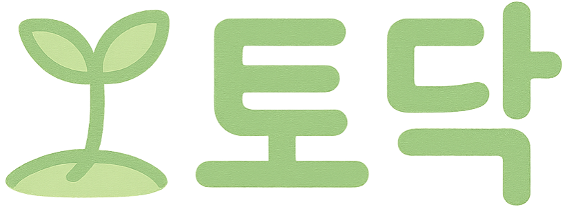
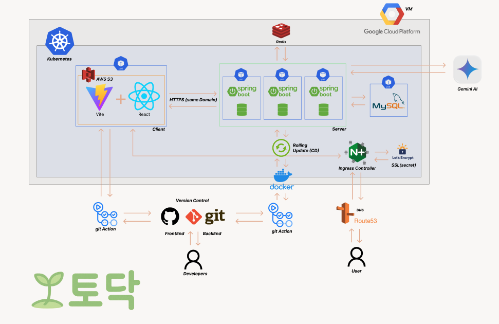
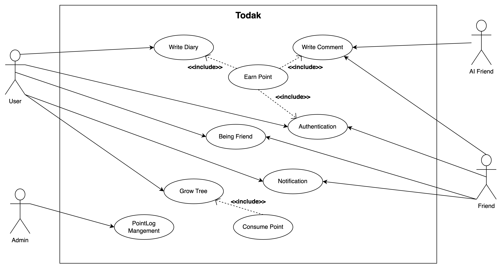
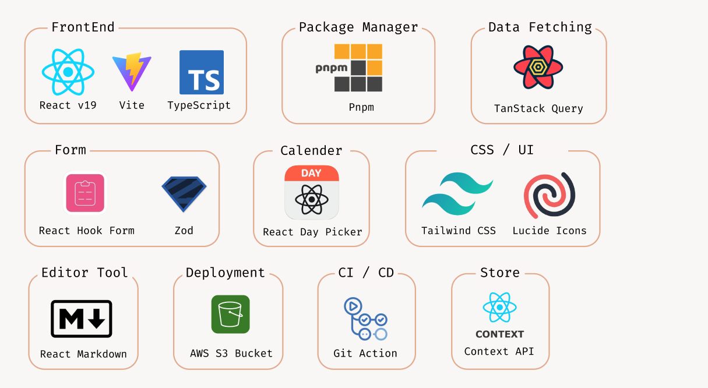
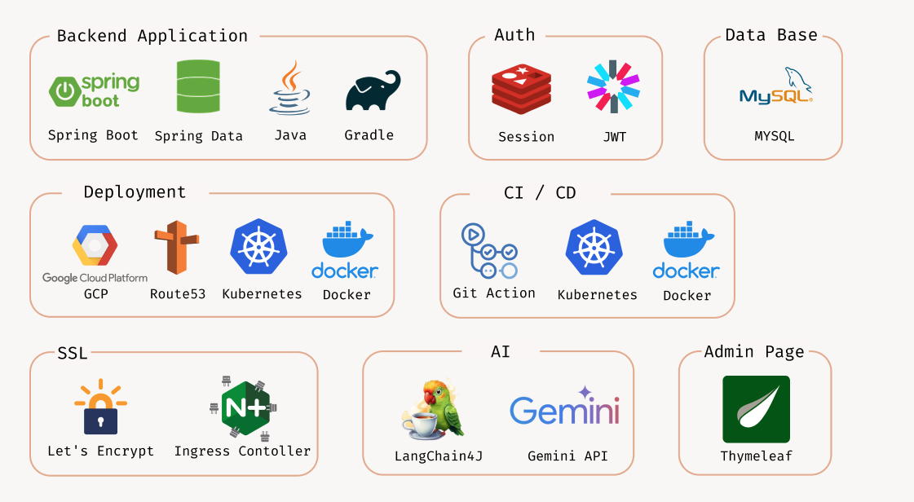
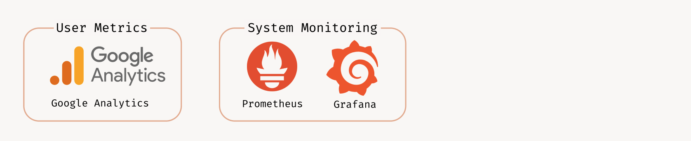
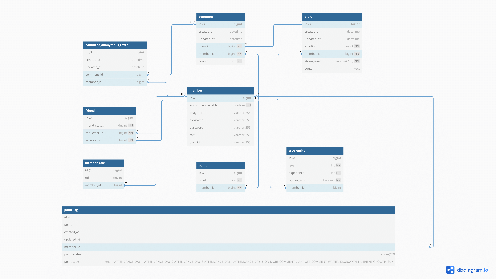

  

# 2025 Google Developer Groups APAC Solution Challenge

# AI-Powered Emotional Support Diary "Todak"
Todak(토닥) is an innovative, private diary service (Closed-Type SNS) where users can freely express their emotions while receiving AI-powered empathetic responses.

# [www.todak.site](https://www.todak.site)

 

## Overview
In modern society, many people lack a safe and private space to express their emotions and receive emotional support. It's often difficult to openly share personal feelings with others, leading to emotional isolation and stress. Todak creates a warm, supportive environment where individuals can freely share their feelings and feel genuinely understood through AI-powered emotional support.

Our solution was developed for the APAC Solution Challenge to address this critical emotional well-being need.

The name "토닥" in Korean means to gently pat someone to offer comfort or emotional support - perfectly capturing the essence of our service.

## 🎥 Demo Video

## 🏗️ System Architecture
A web application architecture diagram showing a monolithic Spring Boot application deployed in multiple instances for rolling updates within a Kubernetes cluster, featuring client-side Vue.js and React, a shared MySQL database

## 🖼️ Use Case Diagram
The following diagram illustrates the main interactions and relationships between users, AI friends, and the system

## 🎯 Key Features
### ✍️ 1. Private Diary Writing
Users can freely write and store their emotions in a closed, secure environment that encourages honest emotional expression without fear of judgment.

### 🤖 2. AI Empathy Companion
Our AI reads diary entries and generates personalized, empathetic comments that feel like support from a warm, understanding friend.

### 🧬 3. MBTI-Based AI Responses
AI provides empathetic and comforting comments based on the diary written by the user, based on one of the 16 MBTI personality types.

### 🕵️‍♀️ 4. Anonymous Comment Fuction
Based on the diary written by the user, users registered as friends and AI can comment. All comments by users and AI are provided anonymously, and anonymity can be deactivated through points.

### 🌱 5. Emotion Growth Visualization
A virtual tree on the main screen grows as users consistently write in their diary, symbolizing emotional growth and encouraging continuous engagement through visual feedback.

### 👫 6. Friend Features
Users can access friends' diaries and guestbooks (with permission) and write comments to support each other, creating a community of emotional support.

### 💎 7. Points System
Users can earn points by checking in daily, writing in a journal, and leaving comments, which can be used to grow the tree and unlock visual progress milestones. Anonymous comments can also be unlocked.

### 📡 8. Real-Time Notifications
The system alerts users when someone comments on their diary or guestbook, implemented using lightweight Server-Sent Events (SSE) and Redis Streams for efficient real-time communication.

### 🔧 9. Admin Dashboard
Built with Thymeleaf, the admin dashboard offers dynamic filtering and management by user, date, and status for effective platform oversight.

### 📊 10. Monitoring and Logging
The backend is monitored using Prometheus and Grafana, with error logs stored per user for analysis and stability improvement.

## 📁 Repository

### [👉 FE Github Repository](https://github.com/GDG-on-Campus-KNU/4th-SC-TEAM1-FE)
### [👉 BE Github Repository](https://github.com/GDG-on-Campus-KNU/4th-SC-TEAM1-BE)

## 🛠️ Tech Spec
### 💻 Frontend

### ⚙️ Backend

### 📊 Monitoring

## 🗃️ ERD
Server Entity Relationship Diagram

## 👥 Team Todak
This project was developed by **Team Todak** to participate in the **APAC Solution Challenge**.
We aim to create a warm service that provides emotional support and emotional stability through technology.
